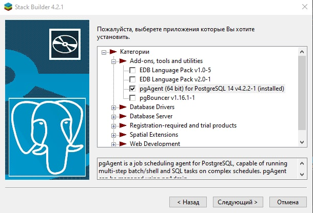
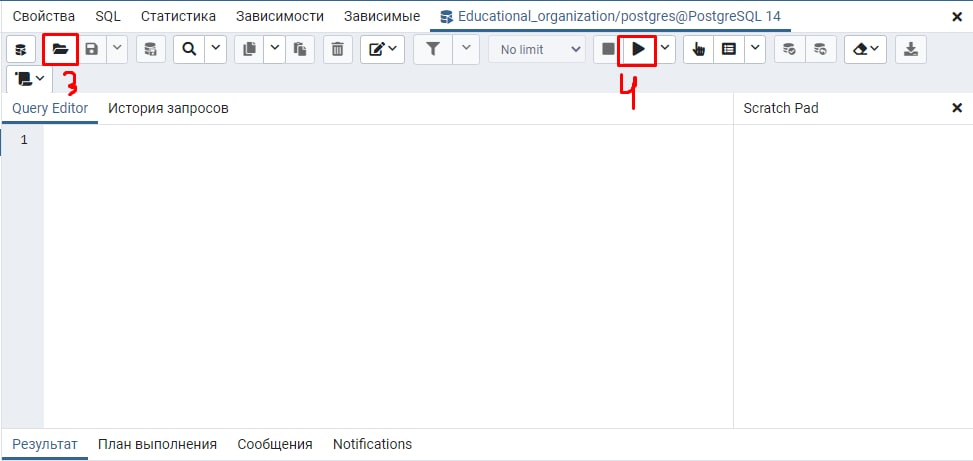

# Как запустить программу?

1. Необходимо скачать полностью данную папку. 
2. Установить на компьютер .NET 6.0. <a href = "https://dotnet.microsoft.com/en-us/download/dotnet/6.0/runtime?cid=getdotnetcore" > Ссылка </a>
3. Установить на компьютер PostgresSQL. <a href = "https://www.postgresql.org/download/" > Ссылка</a>
3.1. С помощью Stack Builder установить pgAgen.

4. Восстановить базу данных (С помощью pgAdmin4) 
4.1. Необходимо создать пустую базу данных  
4.2. Восстановить с помощью SQL скрипта (***Global_object.sql***) все глобальны объекты. 
4.3. С помощью графического интерфейса pgAdmin4 это делается вот так  1) Необходимо выбрать созданную базу данных 2) Нажать на кнопку для содание Query Editor 3) Открыть файл ***Global_object.sql***  4) Запустить скрипт  
    4.4. Восстановить базу данных  1) ПКМ по базе данных   2) Восстановить (restore) 3) Выбрать файл ***backupDB.backup*** 4) Нажать на кнопку Восстановить   

5. Для восстановление базы данных с командной строки необходимо воспользоваться утилитой pg_restore.
6. Запустить **Education_organisation.exe**. 
